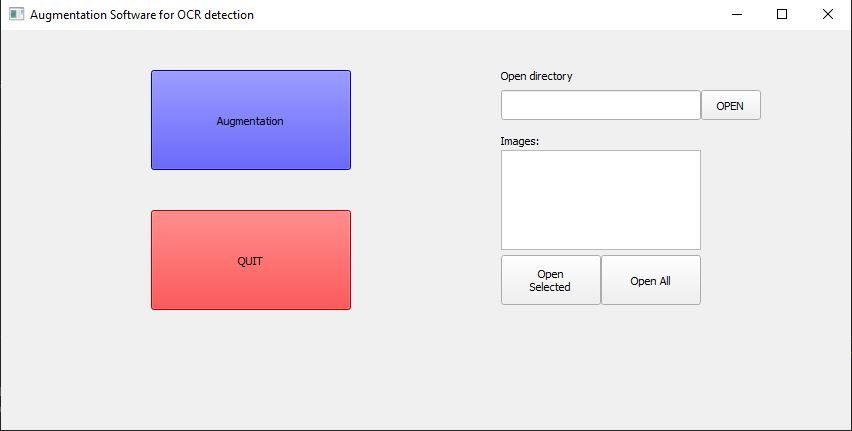
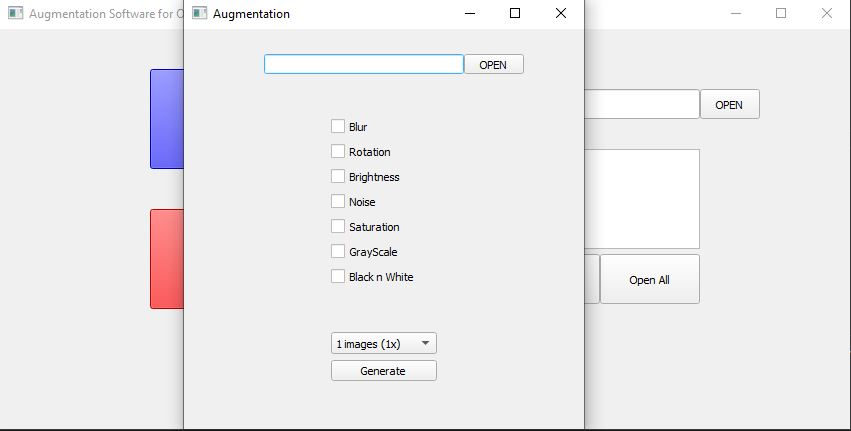
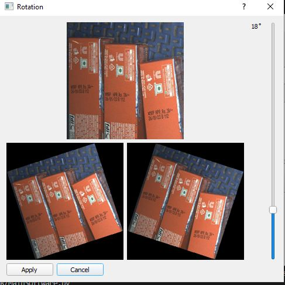
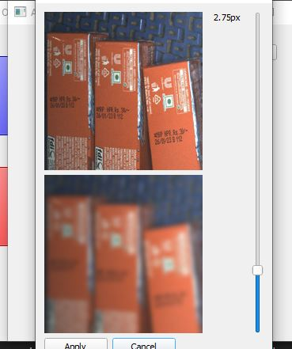
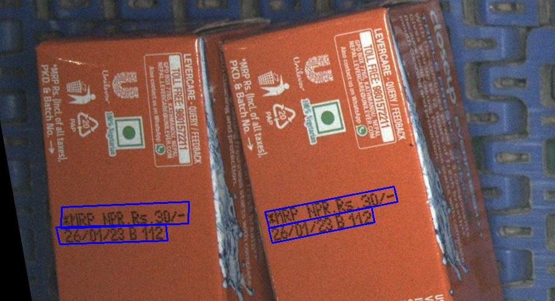

# Augmentation Software for OCR detection

This software is designed to support OCR (Optical Character Recognition) model development by providing the necessary tools to augment the detection dataset. With the growing demand for high accuracy in OCR technology, it is essential to have a robust dataset that can capture a wide variety of scenarios and variations in text characters. This software helps in collecting and labeling the data to create a well-rounded dataset, enabling OCR models to be trained on a diverse set of images and improve the overall accuracy of the model. Whether you're working on a research project, developing a new OCR product, or enhancing existing OCR technology, this software is an indispensable tool for augmenting the detection dataset of your OCR models.

## Deployment

To deploy this project

```bash
  run 'MainSoftware.py'
```

## Description












- Select 'Augmentation' box
- Select folder containing images, images most have bounding box with same name in the ICDAR format 
i.e. 

74, 362, 282, 389, 275, 425, 67, 396, *MRP NPR.Rs.30/-
60, 393, 238, 419, 236, 446, 61, 421, 26/01/23 B 112
402, 428, 618, 423, 620, 449, 404, 454, *MRP NPR. Rs.30/-
403, 455, 576, 449, 576, 476, 405, 480, 26/01/23 B 112

Note: 
- end words like '*MRP NPR.Rs.30/-' are optional
- For converting paddleocr label i.e. 
C:/Users/dell/Desktop/innate_solutions/Gorkha_brewery/Paddle/Detection/doc/imgs_en/102.jpg	[{"transcription": "", "points": [[850, 554], [997, 598], [988, 628], [841, 583]]}, {"transcription": "", "points": [[854, 526], [1000, 567], [992, 594], [847, 552]]}, {"transcription": "", "points": [[487, 433], [677, 490], [668, 520], [478, 463]]}, {"transcription": "", "points": [[492, 406], [718, 472], [711, 498], [484, 431]]}]

to 
850, 554, 997, 598, 988, 628, 841, 583
854, 526, 1000, 567, 992, 594, 847, 552
487, 433, 677, 490, 668, 520, 478, 463
492, 406, 718, 472, 711, 498, 484, 431

you can run 'ppOcr2BB.py'

```bash
  run python ppOcr2BB.py --pp_txt=location of ppocr label.txt --out_dir= directory where you want to keep .txt files
```
eg,

python ppOcr2BB.py --pp_txt=C:/predicts_db.txt --out_dir=C:/det_db/outtxt/

- Click on the augmentation methods 

- Click on the dropdown menu in the bottom to generate number of images

- Click 'Generate' to generate images, images will be saved in the folder named 'Augmentation' in the same folder where images are located.

For Viewing images,

- Click on 'open directory'
- Click 'open select' to view one image at a time
- Click 'Open all' to view all images, to view next - - click 'd', to go back click 'a' , to close the image click 'q'


## If this repository helps you，please star it. Thanks.